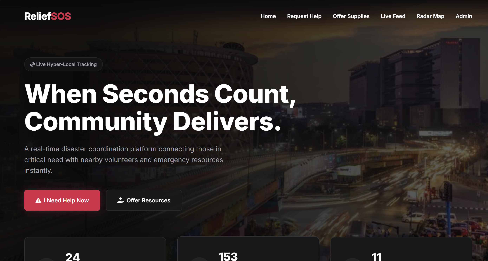
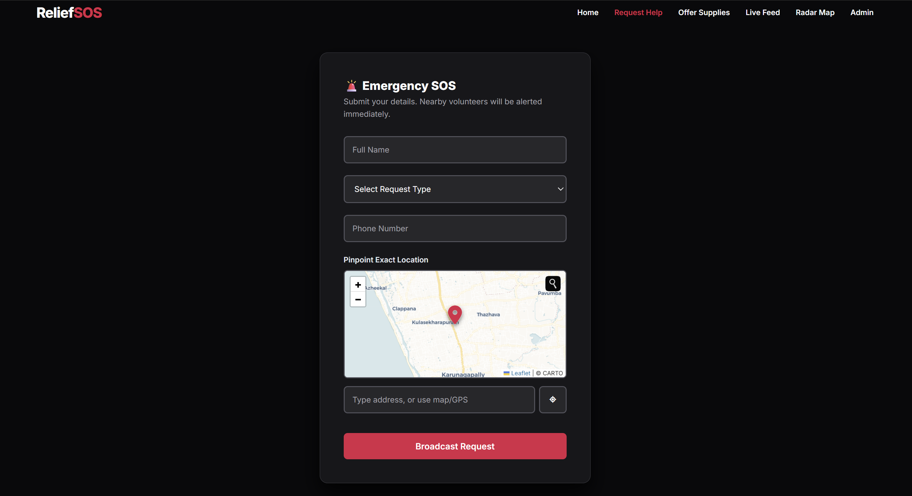
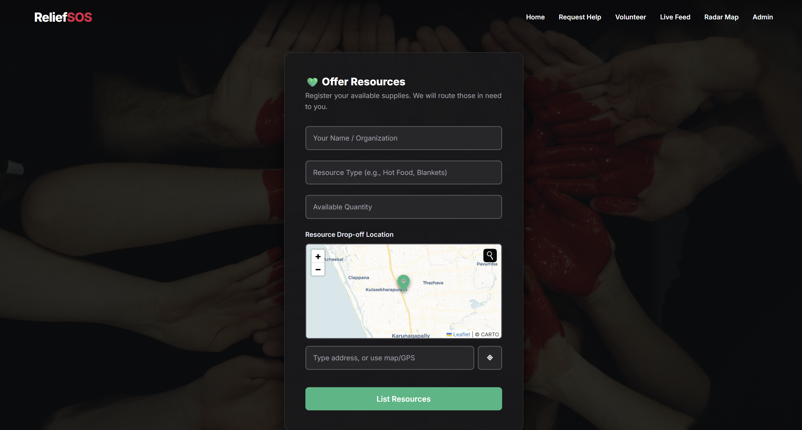
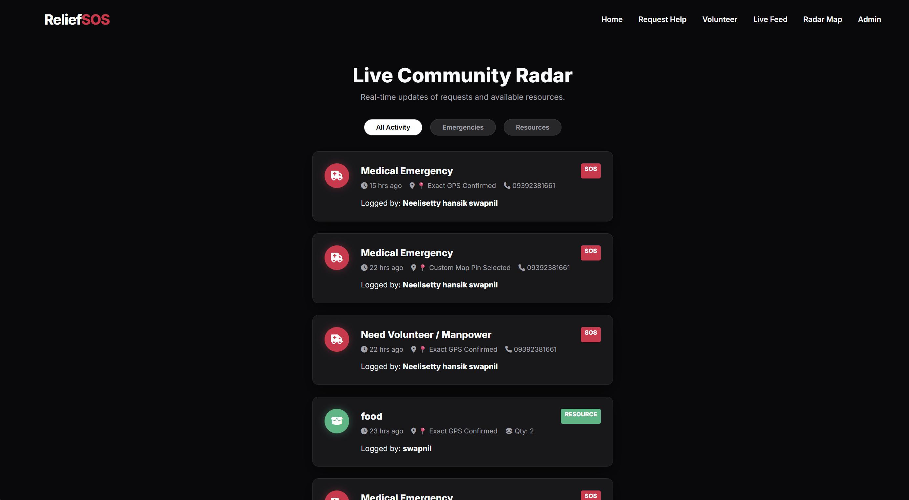
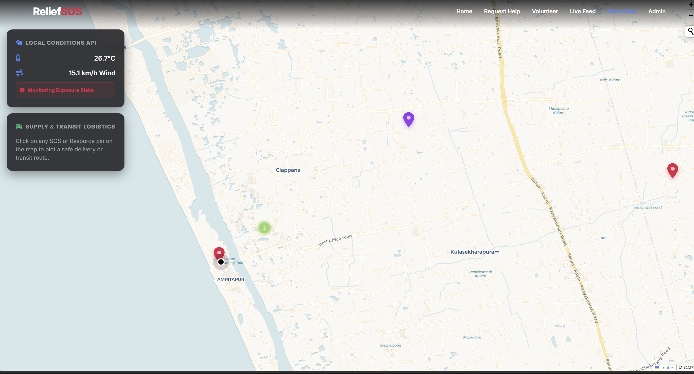
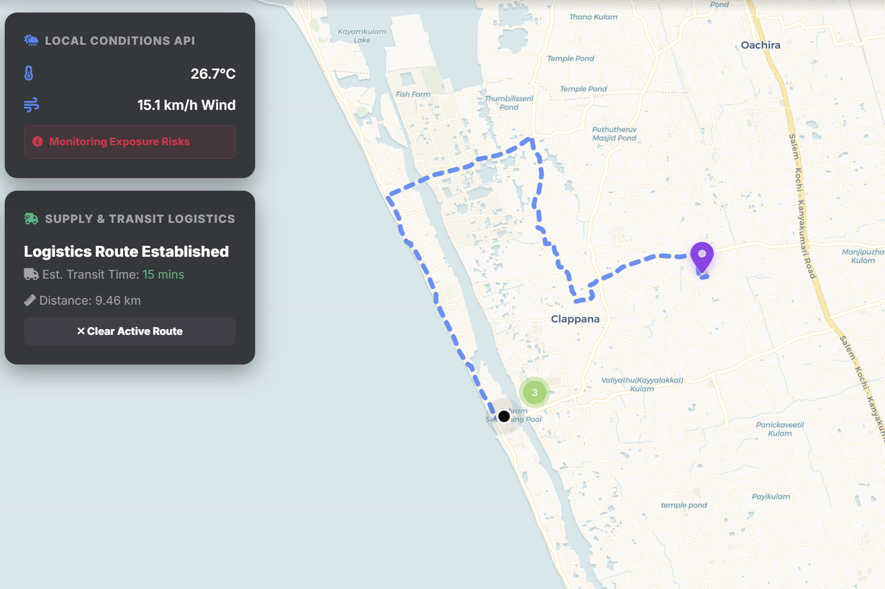
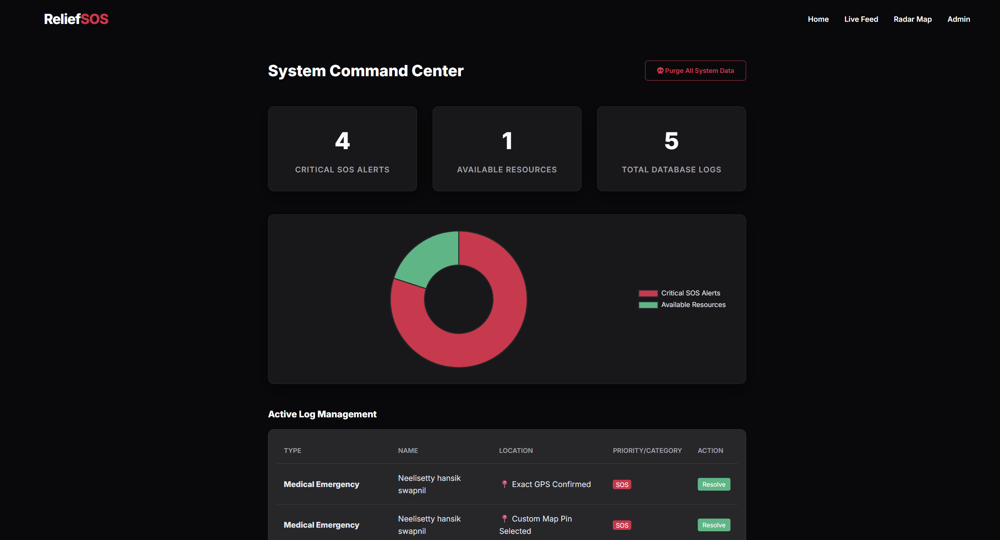

#  ReliefSOS — Hyper-Local Disaster Relief & SOS Coordinator

ReliefSOS is a hyper-local disaster relief coordination platform that connects people in critical need with nearby volunteers and emergency resources in real time. Built as a Progressive Web App (PWA), it features an automated triage engine,an interactive radar map, and a live community feed — making disaster response faster, smarter, and more organised.

--- 

## Team Members
1.Saket.C -Main UI building (index.html,styles.css)  
2.S.V.Karthik -SOS and help forms(help.html,needhelp.html)  
3.Swapnil.N -Live feed(feed.html,feed.js)   
4.P.Sputhnik -Radar Map(map.html,map.js)  
5.M.Yaswanth -Admin and PWA(admin.html,admin.js)  

## Live Website
https://saketc86.github.io/Disaster-Relief-System/
---

## Features

-  **SOS Request System** — Submit emergency alerts with GPS-pinned location
-  **Volunteer Resource Registry** — List available supplies for routing
-  **Live Community Feed** — Real-time log of all active SOS & resource posts
-  **Radar Map** — Interactive Leaflet map with marker clustering & route plotting
-  **Auto Triage Engine** — Keyword-based severity classification (Code Red/Yellow/Green)
-  **Live Weather API** — Open-Meteo integration for local hazard monitoring
-  **Logistics Routing** — Leaflet Routing Machine for optimal transit paths
-  **Admin Dashboard** — Resolve tickets, view stats, purge data
-  **PWA Ready** — Installable on mobile with offline caching via Service Worker

---

## Technologies Used

### Core Technologies
- HTML5
- CSS3
- JavaScript 

### Additional Technologies
- Leaflet.js — Interactive map rendering
- Leaflet Routing Machine — Route plotting between locations
- Leaflet Control Geocoder — Address to coordinate resolution
- Open-Meteo API — Live local weather data
- Chart.js — Admin dashboard statistics
- Web App Manifest + Service Worker — PWA support (installable, offline-capable)

--- 

##  Screenshots

### Homepage

### SOS Form

### Resource form

### Live Feed

### Radar Map

### Map tracking

### Admin Dashboard

